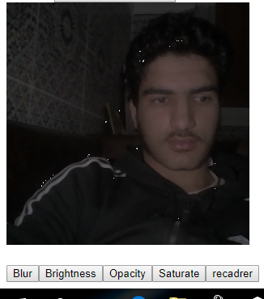

# Capture d'une photo avec canvas

Notre objective est de faire la développement d’un module permettant de capturer la photo de l’utilisateur pour pouvoir l’ajouter à son profile. Ce module sera utilisable dans les applications Web, Mobiles hybrides et Desktop basées sur les technologies WEB. 
Le module sera développé en utilisant une approche incrémentale en trois versions successives :


## Getting Started


Ces instructions vous permettront d’obtenir une copie du projet opérationnel sur votre ordinateur local à des fins de développement et de test

### Conditions préalables

vous aurez juste besoin d'un navigateur Web 

### ETAPE 1 : capture d'une photo

dans cette étape, une vidéo commencera à montrer la caméra
après cela, si vous voulez prendre une photo, vous devez cliquer sur le bouton et attendre 3 secondes.
et si vous avez aimé la photo, vous pouvez la sauvegarder
et si non la vidéo sera toujours en cours d'exécution pour prendre plus de photos


cette fonction fait démarrer la vidéo
```
            start() {

            this.container.appendChild(this.video);
            this.container.appendChild(this.captureButton);
            this.container.appendChild(this.timer);
            this.container.appendChild(this.capture);

            this.initStream();
         
            }
```


cette fonction permettra à l'utilisateur de prendre une photo

```
takePicture() {

        const context = this.canvas.getContext('2d');
        context.drawImage(this.video, 0, 0);
      
    }
```
demonstartion de l'etape 1 :

<br>
<br>
### ETAPE 2 : Ajout des filtres

Dans cette version l’interface contiendra en plus des éléments décrits dans la version 1, un ensemble de boutons permettant d’ajuster les réglages de l’image capturée. Un bouton « enregistrer » permettra l’enregistrement de l’image finalisée 


j'ai utilisé pour cette version 4 filtres : blur , brightness , opacity and saturate
cette fonction qui crée les boutons de filtres

```
setupFilters() {
        this.config.filter.initialized = true;
        
        const { filter: {filterNames, filterFuncs} } = this.config;

        filterNames.map((filter, i) => {
            const button = document.createElement('button');
            button.textContent = filter;
            if(filter == 'Sepia'){
                button.style = 'display : block; visibility : hidden';
            }
            button.className = 'takemephoto-filter'; // to give the users the ability to style the buttons
            button.addEventListener('click', () => this.setupFilter(filterFuncs[i]));
            
            this.capture.appendChild(button);
        });
             }
```


cette fonction applique le filtre donné à canvas

```
applyFilter(canvas, value, filter) {
        const ctx = canvas.getContext('2d');
        ctx.clearRect(0, 0, canvas.width, canvas.height);
        ctx.filter = `${name}(${value}${unit})`;
        ctx.drawImage(this.canvas, 0, 0);
   }
 ```
 
 demonstartion de l'etape 2 :

<br>
<br>
<br>

### ETAPE3 : RECADRER L'IMAGE

Le rectangle de recadrage doit permettre comporte 8 poignets nommées en utilisant les quatre cardinalités : N pour Nord, E pour Est, O pour Ouest et S pour Sud. Les quatre poignets sont donc : NN, NE, NO, EE, OO, SE, SS et SO :  Les poignets EE et OO sont sensibles uniquement au recadrage en largeur, 
 Les poignets NN et SS sont sensibles uniquement au recadrage en hauteur,  Les poignets NE, NO, SE et SO sont sensibles uniquement au recadrage en hauteur et en largeur 
de manière proportionnelle. 
Une bande en L extérieure à chacune des poignets NE, NO, SE et SO non affichée dans l’image, permettra de pivoter l’Outline de recadrage. 
Quand le recadrage est effectué, l’utilisateur appuie sur le bouton « enregistrer » et obtient l’image recadrée. 
 
 cette foction montre comment recadrer une image
 
 ```
 resizable.onmousedown = (e) => {

            if(e.target != resizable) return false;

            const original_x = resizable.getBoundingClientRect().left - canvas.getBoundingClientRect().left;
            const original_y = resizable.getBoundingClientRect().top - canvas.getBoundingClientRect().top;
            const { width, height } = resizable.getBoundingClientRect();

            const original_mouse_x = e.pageX;
            const original_mouse_y = e.pageY;

            const { left:leftLimit, right:rightLimit, top:topLimit, bottom:bottomLimit } = canvas.getBoundingClientRect();

            function startMoving(e) {

                const left = original_x + (e.pageX - original_mouse_x);
                const top = original_y + (e.pageY - original_mouse_y);

                if( (leftLimit+left+width) <= rightLimit ) {
                    if(left >= 0) {
                        resizable.style.left = `${left}px`;
                    }else {
                        resizable.style.left = '0';
                    }
                }else {
                    resizable.style.left = `${rightLimit-leftLimit-width}px`;
                }
                
                if( (topLimit+top+height) <= bottomLimit ) {
                    if(top >= 0) {
                        resizable.style.top = `${top}px`;
                    }else {
                        resizable.style.top = `0`;
                    }
                }else {
                    resizable.style.top = `${bottomLimit-topLimit-height}px`;
                }
            }

            function stopMoving() {
                window.removeEventListener('mousemove', startMoving);
                window.removeEventListener('mouseup', stopMoving);
            }

            window.addEventListener('mousemove', startMoving);
            window.addEventListener('mouseup', stopMoving);

        }

 ```
 
 demonstartion de l'etape 3 :

<br>
<br>

 ###Hebergement du travail dans NPM
 La version 3, mais hébergée dans npmjs.org de façon à ce que tout le monde pourra l’utiliser <br>
 <br>
 <br>
 <br>
 
 

vous pouvez télécharger le module avec npm :
```
npm install capturepictureglsid           
```
